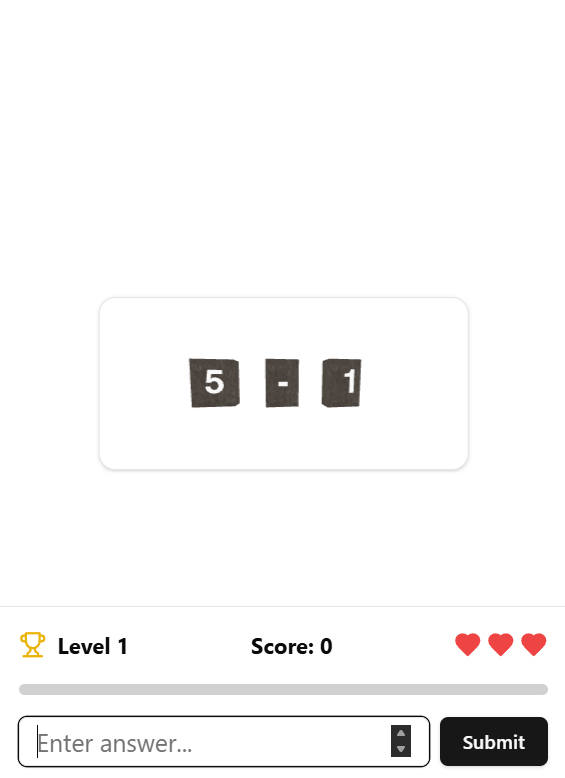
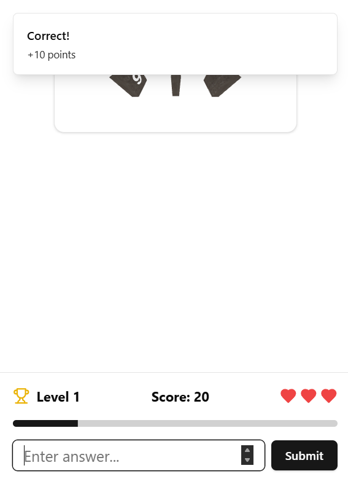
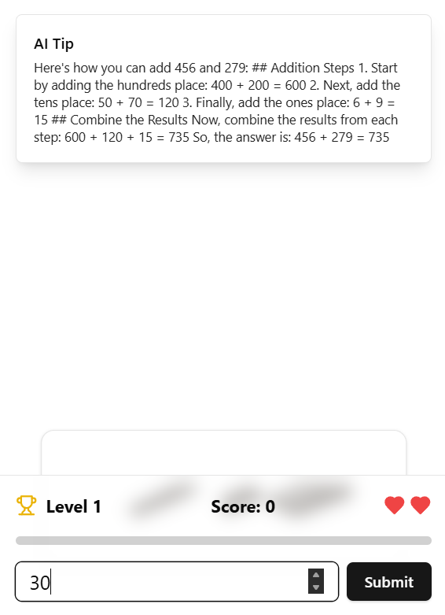
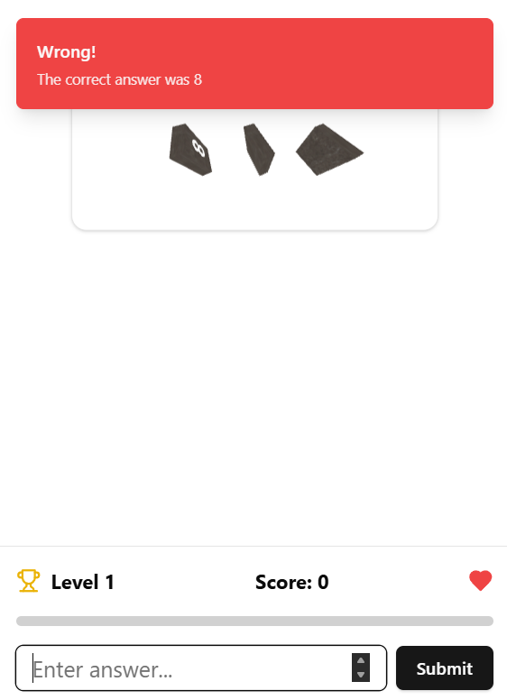

# React Math Game 3D
It is an immersive math game designed to make learning math fun and interactive. Leveraging the power of React, Three Fiber, and Web LLM local model, it offers an engaging experience for players of all ages.

##Features
- Immersive 3D Environment: Explore a vibrant, interactive world that brings math to life.
- Personalized Learning: Web LLM local model adapts to the player's skill level, providing a tailored learning experience.
- Challenging Levels: Progress through increasingly difficult levels.
- Real-time Feedback: Receive instant feedback on your answers, helping you learn and improve quickly.

## Technical Details
- Frontend: Built with React and React Three Fiber for a seamless 3D experience.
- AI Model: Utilizes Web LLM local model for personalized learning and real-time feedback.

### Game Interface

